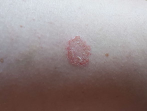

# Nummular eczema 錢幣狀濕疹

### Etiology and pathogenesis

- unclear，但有可能是一種 autosensitization to allergens or irritants

### Epidemiology and risk factors

- Epidemiology
    - 20 - 65 歲，三十幾歲最常見
- Risk factors
    - contact dermatitis
    - stress
    - alcohol

### Clinical presentation

- Symptoms and signs
    - coin-shaped, itching lesion
    - 常見於四肢，可能不太癢，也可能很癢

### Diagnosis and workup

- Diagnosis
    - clinically
- Workup
    - 一般來說不需要

### Management、Prognosis and follow up

- Management
    - skin care：保濕乳液、避免接觸刺激物如肥皂、清潔劑
    - topical steroid
    - short course systemic steroid may be concerned in severe case
    - dupilumab 可能可以改善症狀
- Prognosis
    - 可能會反覆發生
    - 乾燥或是溫暖的氣候可能會加劇

---

### Reference

1. [DynaMed. Nummular Eczema. EBSCO Information Services. Accessed 2026年1月16日](https://www.dynamed.com/condition/nummular-eczema)